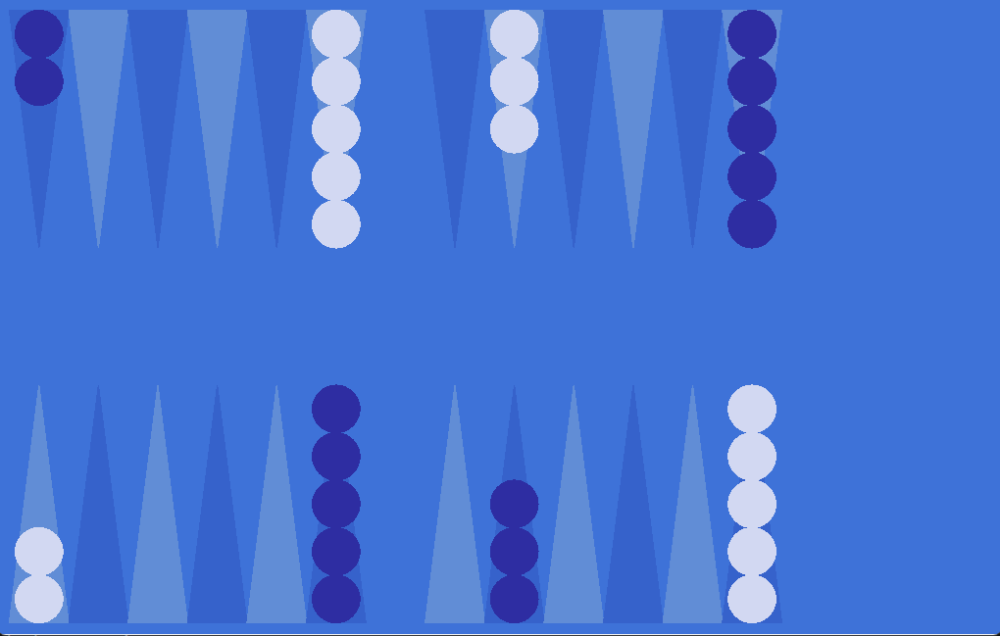
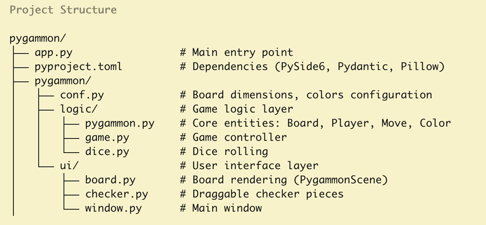

# pygammon

A backgammon game written in **Python**, using **PySide6** for the graphical interface and following a **Model–View–Controller (MVC)** architecture.

---

## Screenshot




---

## Installation

### 1. Clone the repository

```bash
git clone https://github.com/filias/pygammon.git  

cd pygammon
```


### 2. Activate the virtual environment
```bash
.venv\Scripts\activate
```

### 3. Install dependencies
Using uv:
    ```bash
    uv sync
    ```

## Run the game
```bash
python app.py
```

## Architecture (MVC)
Model: Game, Board, Player, Color  
View: PygammonScene, MovableChecker, QGraphicsView  
Controller: app.py, BackgammonWindow

## Project Structure


## Authors
Developed by Filipa.
