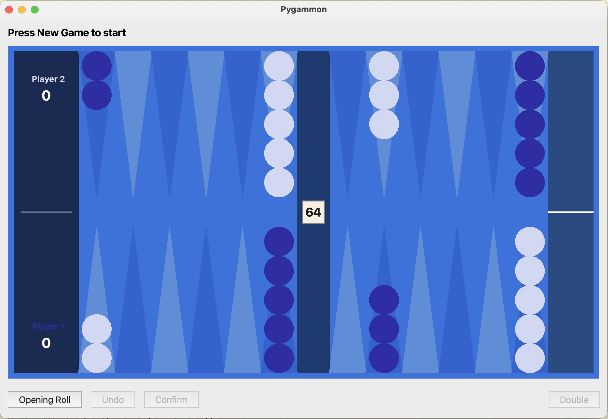
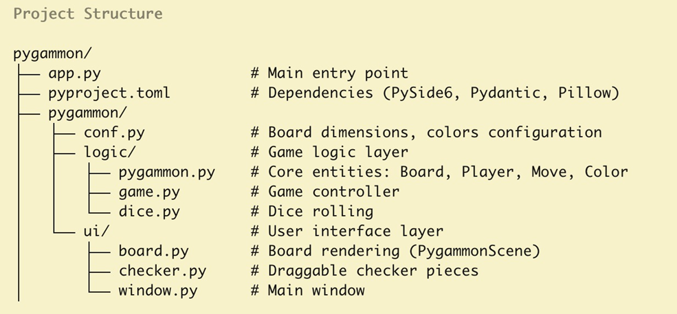

# pygammon

A backgammon game written in **Python**, using **PySide6** for the graphical interface and following a **Model–View–Controller (MVC)** architecture.

---

## Screenshot




---

## Installation

### Clone the repository

```bash
git clone https://github.com/filias/pygammon.git  

cd pygammon
```
### Install dependencies
Using uv:
```bash
uv sync
```

## Run the game
```bash
uv run python app.py
```

## Train the AI

### Install AI dependencies
```bash
uv sync --extra ai
```

### Run self-play training
```bash
uv run python -u -m pygammon.ai.train_selfplay --episodes 1000
```

Options:
- `--episodes N` — number of self-play games (start with 1000, more = stronger)
- `--hidden-size 80` — hidden layer neurons
- `--lr 0.1` — learning rate
- `--lamda 0.7` — TD(lambda) trace decay
- `--checkpoint-dir checkpoints` — where to save models
- `--checkpoint-every 100` — save every N episodes
- `--resume checkpoints/td_gammon_final.weights.h5` — continue from a checkpoint
- `--logdir logs` — TensorBoard log directory

### Resume training

Training sessions can be combined. The `--resume` flag loads the weights from a previous session and continues learning from where it left off:

```bash
# Session 1: train 1000 episodes
uv run python -u -m pygammon.ai.train_selfplay --episodes 1000

# Session 2: load the result and train 1000 more
uv run python -u -m pygammon.ai.train_selfplay --episodes 1000 --resume checkpoints/td_gammon_final.weights.h5
```

You can do this as many times as you want — train 1000 today, resume with 5000 tomorrow, resume with 50000 next week. The network keeps all the knowledge it learned and keeps improving.

### Monitor training (optional)
[TensorBoard](https://www.tensorflow.org/tensorboard) is a web dashboard that visualizes training progress — it plots graphs like win rate and moves per game over time. It's installed with `uv sync --extra ai` but is not required; the console already prints stats every 10 episodes.

To use it:
```bash
uv run tensorboard --logdir logs
```
Then open http://localhost:6006 in your browser.

### Play against the AI
Run the game and go to **Game → Play vs AI**, then select a checkpoint file from the `checkpoints/` directory.

### How the AI works

The AI uses **TD-Gammon**, a reinforcement learning approach from [Tesauro's 1992 paper](https://en.wikipedia.org/wiki/TD-Gammon) where a neural network learns to evaluate board positions by playing against itself.

#### What is a neural network?

A neural network is a chain of simple math operations. Ours has two layers:

- **Hidden layer (80 neurons):** Each neuron takes all 198 input numbers, multiplies each by a **weight** (a number learned during training), adds them up, and squishes the result between 0 and 1. This gives 80 numbers.
- **Output layer (1 neuron):** Takes those 80 numbers, multiplies each by a weight, adds them up, squishes again. Outputs a single number.

**What is a neuron?** Just a tiny math function — a weighted sum followed by a squish:

```
inputs:  [0.5, 1.0, 0.3]
weights: [0.2, -0.8, 0.4]     (learned during training)

step 1: multiply  → 0.1, -0.8, 0.12
step 2: add up    → -0.58
step 3: squish    → 0.36

output: 0.36
```

Our network has 15,921 weights total (`198 x 80 + 80 + 80 x 1 + 1`). Those weights **are** the AI's knowledge — everything it knows about backgammon is encoded in those numbers.

**Why 80 neurons?** It's what Tesauro used in the original paper. 40 is too few to capture the subtleties, 160 is slightly stronger but much slower to train. 80 is a good balance.

#### The output: win probability

The output is a number between 0 and 1 — the estimated probability that Dark wins:

- `0.0` = Dark has no chance
- `0.5` = even game
- `1.0` = Dark is certain to win

When the AI plays as Light, it flips the value: `1.0 - 0.72 = 0.28`, and picks moves that make Dark's probability as low as possible.

#### The input: 198 features

A **feature** is just a number that describes one aspect of the board. The network can't "look" at the board — it needs the position described as a list of numbers.

For each of the 24 points, for each player, we encode 4 numbers:

| Checkers | Feature 1 | Feature 2 | Feature 3 | Feature 4 |
|----------|-----------|-----------|-----------|-----------|
| 0        | 0         | 0         | 0         | 0         |
| 1        | 1         | 0         | 0         | 0         |
| 2        | 1         | 1         | 0         | 0         |
| 3        | 1         | 1         | 1         | 0         |
| 5        | 1         | 1         | 1         | 1.0       |

The first 3 are flags: "at least 1?", "at least 2?", "at least 3?". The 4th encodes extras as `(n-3)/2`. This encoding matters because 1 checker (a blot, vulnerable), 2 checkers (a made point, blocks opponent), and 3+ checkers have very different strategic meaning.

The full 198 numbers: `24 points x 2 players x 4 features = 192`, plus bar (2), borne off (2), and whose turn (2).

**Example** — the starting position encoded as the AI sees it:

```
[
  1,1,0,0,  0,0,0,0,    # point 1:  dark x2
  0,0,0,0,  0,0,0,0,    # point 2:  empty
  0,0,0,0,  0,0,0,0,    # point 3:  empty
  0,0,0,0,  0,0,0,0,    # point 4:  empty
  0,0,0,0,  0,0,0,0,    # point 5:  empty
  0,0,0,0,  1,1,1,1.0,  # point 6:  light x5
  0,0,0,0,  0,0,0,0,    # point 7:  empty
  0,0,0,0,  1,1,1,0,    # point 8:  light x3
  ...                    # points 9-11: empty
  1,1,1,1.0, 0,0,0,0,   # point 12: dark x5
  0,0,0,0,  1,1,1,1.0,  # point 13: light x5
  ...                    # points 14-16: empty
  1,1,1,0,  0,0,0,0,    # point 17: dark x3
  0,0,0,0,  0,0,0,0,    # point 18: empty
  1,1,1,1.0, 0,0,0,0,   # point 19: dark x5
  ...                    # points 20-23: empty
  0,0,0,0,  1,1,0,0,    # point 24: light x2
  0, 0,                  # bar:  dark 0, light 0
  0, 0,                  # off:  dark 0, light 0
  1, 0                   # turn: dark's turn
]
```

#### How it chooses moves

When the AI needs to make a move, say it has 4 legal options:

1. Simulate each move on a copy of the board
2. Encode each resulting position into 198 numbers
3. Feed each through the network to get a win probability
4. Pick the move with the highest probability

```
Move A: point 13 → 8   → network says 0.47
Move B: point 13 → 10  → network says 0.52  ← picks this one
Move C: point 19 → 16  → network says 0.49
Move D: point 1  → 4   → network says 0.44
```

#### How it learns

At the start, all weights are random — the network outputs nonsense. But it improves through self-play:

1. The AI plays a full game against itself (both sides)
2. After each move, it compares its prediction *before* vs *after* — this difference is the **TD error**
3. It nudges the weights slightly to make predictions more consistent
4. At game end, the actual result (Dark won = 1, Light won = 0) provides the final correction
5. Repeat for thousands of games

It's like learning to guess someone's age. At first you're bad at it. But every time you guess and find out the real answer, you adjust. After meeting thousands of people, you're accurate — even though nobody taught you explicit rules.

**Eligibility traces** (the `lambda` parameter) speed this up by giving credit to moves made several turns ago, not just the most recent one.

**No exploration needed** — unlike most reinforcement learning, backgammon has dice rolls which naturally inject randomness. The AI always picks its best move, and the dice ensure it sees diverse positions.

#### What to expect

- ~1,000 episodes: learns basic checker movement
- ~50,000 episodes: starts playing reasonably
- ~300,000+ episodes: approaches strong play (the original paper used 1.5M)

The network is small (198 → 80 → 1) so each episode is fast even on CPU.

## Apply formatting
```bash
uv run ruff format
```

## Architecture (MVC)
Model: Game, Board, Player, Color
View: PygammonScene, CheckerItem, QGraphicsView
Controller: GameController, GameEngine, app.py

## Project Structure

